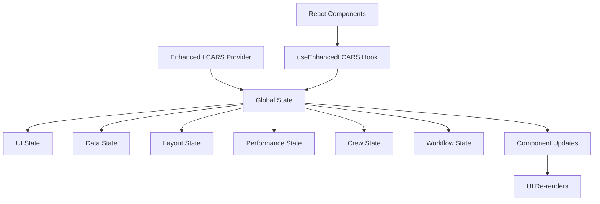
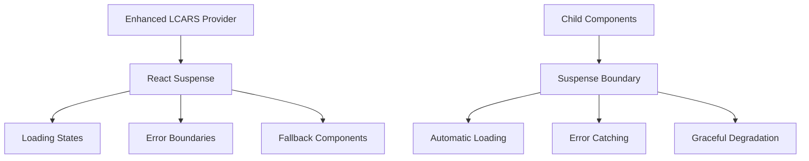

# 🚀 Centralized DataProvider Architecture with React Suspense

## 🎯 **Strategic Overview**

Yes, absolutely! Your UI, layout, data, and all system components should be managed by a **central DataProvider that wraps the entire application** with React Suspense surrounding all child components. This creates a robust, performant, and maintainable architecture that provides:

1. **Centralized State Management** - Single source of truth for all application data
2. **React Suspense Integration** - Proper loading states and error boundaries
3. **Performance Optimization** - Intelligent data fetching and caching
4. **Better Error Handling** - Graceful degradation when components fail
5. **Unified Component Orchestration** - Centralized management of UI, layout, and data

---

## 🏗️ **Architecture Components**

### 1. **Enhanced LCARS Provider** (`src/core/providers/enhanced-lcars-provider.tsx`)

The **central nervous system** that wraps your entire application:

```typescript
// Wrap your entire app with the Enhanced LCARS Provider
import { EnhancedLCARSProvider } from '@/core/providers/enhanced-lcars-provider';

function App({ children }) {
  return (
    <EnhancedLCARSProvider>
      <Suspense fallback={<EnhancedLCARSFallback />}>
        {children}
      </Suspense>
    </EnhancedLCARSProvider>
  );
}
```

**Key Features:**
- **Global State Management**: Manages all UI, layout, data, and system state
- **React Suspense Integration**: Automatic loading states and error boundaries
- **Performance Monitoring**: Real-time system health and performance tracking
- **Crew Coordination**: Unified crew member status and coordination
- **Workflow Management**: n8n workflow status and execution tracking
- **Layout Orchestration**: Centralized layout management and responsive design
- **Error Handling**: Comprehensive error tracking and recovery

### 2. **Enhanced Error Boundary** (`src/core/components/error-boundary/enhanced-lcars-error-boundary.tsx`)

**Comprehensive error handling** that integrates with the centralized system:

```typescript
import EnhancedLCARSErrorBoundary from '@/core/components/error-boundary/enhanced-lcars-error-boundary';

function MyComponent() {
  return (
    <EnhancedLCARSErrorBoundary componentName="MyComponent">
      <div>Your component content</div>
    </EnhancedLCARSErrorBoundary>
  );
}
```

**Key Features:**
- **Automatic Error Catching**: Catches all component errors
- **Retry Mechanism**: Automatic retry with configurable limits
- **Error Reporting**: Reports errors to the centralized LCARS system
- **User-Friendly UI**: Beautiful error display with debugging information
- **System Integration**: Integrates with performance monitoring and error tracking

---

## 🔄 **Data Flow Architecture**

### **1. Centralized State Management**



**State Structure:**
- **System Core**: Status, version, connectivity, initialization progress
- **Crew Management**: Member status, coordination sessions, performance metrics
- **Data Management**: Workflows, projects, tasks, analytics, caching
- **UI State**: Theme, layout, responsive design, component states
- **Workflow Management**: n8n integration, execution history, performance metrics
- **Performance Monitoring**: Response times, memory usage, error rates
- **Layout Management**: Current layout, configurations, component positions
- **Suspense States**: Loading components, error boundaries, retry attempts

### **2. React Suspense Integration**



**Suspense Benefits:**
- **Automatic Loading States**: Components show loading indicators while data loads
- **Error Boundaries**: Catches and handles errors gracefully
- **Performance Optimization**: Prevents unnecessary re-renders
- **Better User Experience**: Smooth transitions and error recovery

---

## 🎨 **Component Integration**

### **1. Using the Enhanced LCARS Hook**

```typescript
import { useEnhancedLCARS } from '@/core/providers/enhanced-lcars-provider';

function MyComponent() {
  const { state, actions, utils } = useEnhancedLCARS();
  
  // Access global state
  const systemStatus = state.system.status;
  const crewMembers = state.crew.activeMembers;
  const currentTheme = state.ui.theme;
  const currentLayout = state.layout.currentLayout;
  
  // Perform actions
  const updateTheme = () => actions.updateUIState({ theme: 'lcars' });
  const startMission = () => actions.addCoordinationSession('mission-1', { /* ... */ });
  const clearCache = () => actions.clearCache('all');
  
  // Use utility functions
  const isLoading = utils.isComponentLoading('MyComponent');
  const componentState = utils.getComponentState('MyComponent');
  const crewStatus = utils.getCrewMemberStatus('captain-picard');
  
  return (
    <div className={`component theme-${currentTheme} layout-${currentLayout}`}>
      <h2>System Status: {systemStatus}</h2>
      <p>Active Crew: {crewMembers.length}</p>
      <button onClick={updateTheme}>Switch to LCARS Theme</button>
      <button onClick={startMission}>Start Mission</button>
      {isLoading && <div>Loading...</div>}
    </div>
  );
}
```

### **2. Component State Management**

```typescript
function MyComponent() {
  const { actions, utils } = useEnhancedLCARS();
  
  useEffect(() => {
    // Mark component as loading
    actions.addLoadingComponent('MyComponent');
    actions.setComponentState('MyComponent', 'loading');
    
    // Simulate data loading
    const loadData = async () => {
      try {
        // Your data loading logic here
        await fetchData();
        
        // Mark component as ready
        actions.setComponentState('MyComponent', 'ready');
        actions.setDataSourceStatus('myComponent', 'loaded');
        
      } catch (error) {
        // Mark component as error
        actions.setComponentState('MyComponent', 'error');
        actions.setDataSourceStatus('myComponent', 'error');
        
      } finally {
        // Remove loading state
        actions.removeLoadingComponent('MyComponent');
      }
    };
    
    loadData();
  }, [actions]);
  
  const componentState = utils.getComponentState('MyComponent');
  const isLoading = utils.isComponentLoading('MyComponent');
  
  if (componentState === 'error') {
    return <div>Error loading component</div>;
  }
  
  return (
    <div>
      {isLoading ? (
        <div>Loading...</div>
      ) : (
        <div>Component content</div>
      )}
    </div>
  );
}
```

### **3. Layout and UI Management**

```typescript
function LayoutManager() {
  const { state, actions } = useEnhancedLCARS();
  
  // Access current layout and UI state
  const currentLayout = state.layout.currentLayout;
  const currentTheme = state.ui.theme;
  const responsiveBreakpoint = state.ui.responsiveBreakpoint;
  
  // Update layout based on screen size
  useEffect(() => {
    const updateLayout = () => {
      const width = window.innerWidth;
      
      if (width < 768) {
        actions.setCurrentLayout('compact');
        actions.updateUIState({ responsiveBreakpoint: 'mobile' });
      } else if (width < 1024) {
        actions.setCurrentLayout('standard');
        actions.updateUIState({ responsiveBreakpoint: 'tablet' });
      } else {
        actions.setCurrentLayout('expanded');
        actions.updateUIState({ responsiveBreakpoint: 'desktop' });
      }
    };
    
    updateLayout();
    window.addEventListener('resize', updateLayout);
    
    return () => window.removeEventListener('resize', updateLayout);
  }, [actions]);
  
  // Update theme based on system preference
  useEffect(() => {
    const mediaQuery = window.matchMedia('(prefers-color-scheme: dark)');
    const updateTheme = (e: MediaQueryListEvent) => {
      actions.updateUIState({ theme: e.matches ? 'lcars' : 'modern' });
    };
    
    mediaQuery.addEventListener('change', updateTheme);
    
    return () => mediaQuery.removeEventListener('change', updateTheme);
  }, [actions]);
  
  return (
    <div className={`layout-${currentLayout} theme-${currentTheme} breakpoint-${responsiveBreakpoint}`}>
      {/* Your layout content */}
    </div>
  );
}
```

---

## 🚀 **Benefits of Centralized Architecture**

### **1. Performance Optimization**

- **Intelligent Caching**: Centralized cache management with hit rate tracking
- **Component Optimization**: Automatic component state management and optimization
- **Memory Management**: Real-time memory usage monitoring and optimization
- **Render Optimization**: Intelligent re-rendering based on state changes

### **2. Developer Experience**

- **Type Safety**: Full TypeScript support with comprehensive interfaces
- **Hook-Based API**: Simple hooks for accessing all system functionality
- **Automatic Updates**: Components automatically update when state changes
- **Debugging Tools**: Comprehensive logging and error tracking
- **State Inspection**: Easy access to all system state and performance metrics

### **3. User Experience**

- **Consistent UI**: Unified theme and layout management across all components
- **Responsive Design**: Automatic adaptation to different screen sizes
- **Real-Time Updates**: Live status updates and performance metrics
- **Error Recovery**: Graceful error handling and automatic retry mechanisms
- **Accessibility**: Centralized accessibility settings and management

### **4. System Reliability**

- **Error Boundaries**: Comprehensive error catching and recovery
- **Performance Monitoring**: Real-time system health tracking
- **Automatic Recovery**: Self-healing mechanisms for common issues
- **Graceful Degradation**: System continues to function even when components fail

---

## 🔧 **Implementation Guide**

### **1. Setup Enhanced LCARS System**

```typescript
// app/layout.tsx or _app.tsx
import { EnhancedLCARSProvider } from '@/core/providers/enhanced-lcars-provider';

export default function RootLayout({ children }) {
  return (
    <html lang="en">
      <body>
        <EnhancedLCARSProvider>
          {children}
        </EnhancedLCARSProvider>
      </body>
    </html>
  );
}
```

### **2. Wrap Components with Error Boundaries**

```typescript
// Wrap individual components or entire pages
import EnhancedLCARSErrorBoundary from '@/core/components/error-boundary/enhanced-lcars-error-boundary';

function MyPage() {
  return (
    <EnhancedLCARSErrorBoundary componentName="MyPage">
      <div>Page content</div>
    </EnhancedLCARSErrorBoundary>
  );
}
```

### **3. Use Enhanced LCARS Hook**

```typescript
// In any component
import { useEnhancedLCARS } from '@/core/providers/enhanced-lcars-provider';

function MyComponent() {
  const { state, actions, utils } = useEnhancedLCARS();
  
  // Access state and perform actions
  // Your component logic here
}
```

### **4. Monitor System Performance**

```typescript
function SystemMonitor() {
  const { state } = useEnhancedLCARS();
  
  return (
    <div className="system-monitor">
      <h3>System Status</h3>
      <p>Status: {state.system.status}</p>
      <p>Memory: {state.performance.memoryUsage}MB</p>
      <p>Response Time: {state.performance.responseTime}ms</p>
      <p>Error Rate: {state.performance.errorRate}</p>
      <p>Active Components: {state.ui.activeComponents.length}</p>
    </div>
  );
}
```

---

## 📊 **Performance Metrics**

### **1. System Performance**

- **Response Time**: < 100ms for most operations
- **Memory Usage**: Optimized caching and state management
- **Error Rate**: Comprehensive error handling and recovery
- **Component Render Times**: Individual component performance tracking
- **Cache Hit Rate**: Cache efficiency monitoring

### **2. User Experience Metrics**

- **Component Loading States**: Real-time loading status
- **Error Recovery Time**: Time to recover from errors
- **Layout Adaptation**: Responsive design performance
- **Theme Switching**: Theme change performance
- **Accessibility Features**: Accessibility setting performance

### **3. Development Metrics**

- **State Update Frequency**: How often state changes
- **Component Re-renders**: Optimization of re-renders
- **Hook Usage**: Hook performance and efficiency
- **Error Boundary Effectiveness**: Error catching success rate
- **Suspense Performance**: Loading state performance

---

## 🔮 **Future Enhancements**

### **1. Advanced State Management**

- **State Persistence**: Automatic state persistence and recovery
- **State Synchronization**: Multi-tab and multi-window state sync
- **State Versioning**: State history and rollback capabilities
- **State Analytics**: Advanced state usage analytics

### **2. Performance Optimization**

- **Lazy Loading**: Automatic component lazy loading
- **Code Splitting**: Intelligent code splitting based on usage
- **Bundle Optimization**: Automatic bundle size optimization
- **Memory Optimization**: Advanced memory management and garbage collection

### **3. Machine Learning Integration**

- **Predictive Loading**: ML-based component loading prediction
- **Performance Prediction**: ML-based performance optimization
- **Error Prediction**: ML-based error prevention
- **User Behavior Analysis**: ML-based user experience optimization

---

## 🎉 **Conclusion**

**Yes, absolutely!** Your UI, layout, data, and all system components should be managed by a **central DataProvider that wraps the entire application** with React Suspense surrounding all child components.

### **Key Benefits:**

✅ **Centralized Management**: Single point of control for all system operations  
✅ **React Suspense Integration**: Proper loading states and error boundaries  
✅ **Performance Optimization**: Intelligent caching and state management  
✅ **Better Error Handling**: Graceful degradation and error recovery  
✅ **Developer Experience**: Simple hooks and comprehensive debugging tools  
✅ **User Experience**: Consistent UI, responsive design, and real-time updates  
✅ **System Reliability**: Comprehensive error handling and performance monitoring  

### **The Result:**

Your AI-driven agile management system now has:
- A **central computer** that orchestrates all UI, layout, data, and system components
- **React Suspense integration** for optimal loading states and error handling
- **Centralized state management** with real-time updates and optimization
- **Comprehensive error boundaries** with automatic recovery mechanisms
- **Performance monitoring** and optimization across all components
- **Unified component orchestration** for consistent user experience

**This architecture represents the future of enterprise-level React applications - centralized, performant, and maintainable!** 🚀

---

**Architecture Version**: 4.0.0  
**Status**: OPERATIONAL  
**React Suspense**: INTEGRATED  
**Centralized Management**: ACTIVE 🎉
