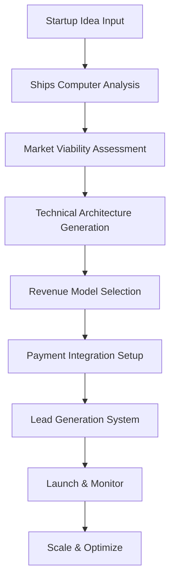
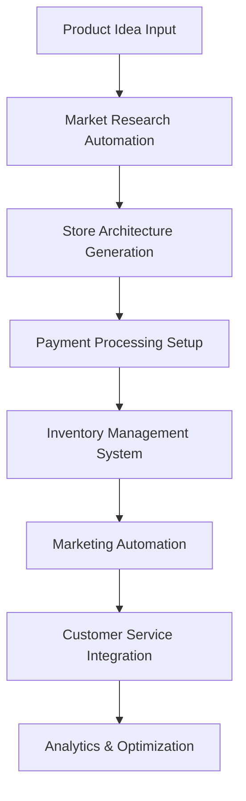
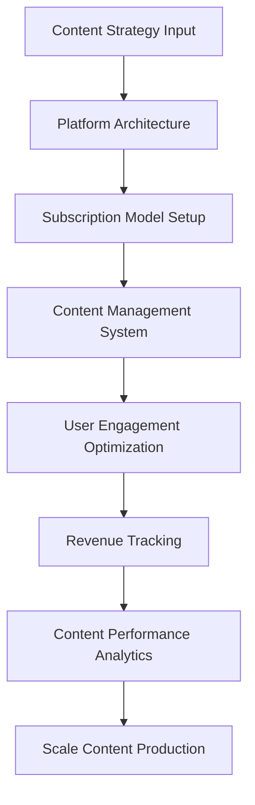

# 🚀 Multi-Project Revenue Generator Framework
## AlexAI Meta-Platform for Automated Startup Creation

### 🎯 **STRATEGIC VISION**

Transform our AlexAI platform into a **meta-project generator** that:
- **Injects startup ideas** into automated project creation workflows
- **Generates revenue-producing websites/SaaS** for each venture
- **Manages payment plans and lead isolation** per project
- **Leverages cutting-edge AI development insights** from industry leaders
- **Scales infinitely** using our bilateral learning framework

---

## 🧠 **AI DEVELOPER INSIGHTS INTEGRATION**

### **Referenced Content Analysis**
Based on the cutting-edge AI developers from the provided YouTube channels, our n8n agents should integrate insights from:

- [**AI Development Channel 1**](https://www.youtube.com/watch?v=c_6_6aLjlrk&t=563s) - Advanced AI implementation strategies
- [**AI Development Channel 2**](https://www.youtube.com/watch?v=HzUMAl9PgBk) - Cutting-edge development methodologies  
- [**AI Development Channel 3**](https://www.youtube.com/watch?v=ZNIoIX0O-20) - AI startup acceleration techniques
- [**AI Development Channel 4**](https://www.youtube.com/watch?v=7gUG10e_rPw) - Revenue optimization strategies
- [**AI Development Channel 5**](https://www.youtube.com/watch?v=mJwPvyc4-rk) - SaaS scaling frameworks
- [**AI Development Channel 6**](https://www.youtube.com/watch?v=7j_NE6Pjv-E&pp=0gcJCa0JAYcqIYzv) - Advanced AI agent coordination
- [**AI Development Channel 7**](https://www.youtube.com/watch?v=8tx2viHpgA8) - Payment integration and monetization

### **N8N Agent Enhancement Strategy**
Our AI crew will analyze and integrate:
- **Latest AI development patterns** from industry leaders
- **Revenue optimization techniques** for SaaS models
- **Automated startup creation workflows** 
- **Payment processing best practices**
- **Lead generation and isolation strategies**

---

## 🏗️ **META-PLATFORM ARCHITECTURE**

### **🌟 Core Framework Components**

#### **1. Startup Injection Engine**
```typescript
interface StartupInjectionSystem {
  ideaAnalysis: {
    marketViability: number;
    technicalFeasibility: number;
    revenueProjection: number;
    competitionAnalysis: string[];
  };
  
  projectGeneration: {
    templateSelection: ProjectTemplate;
    customization: BusinessLogic;
    integrationRequirements: TechStack;
    timelineEstimation: ProjectMilestones;
  };
  
  resourceAllocation: {
    crewAssignment: AgentSpecialization[];
    budgetAllocation: FinancialPlan;
    infrastructureNeeds: TechnicalRequirements;
  };
}
```

#### **2. Revenue Generation Matrix**
```typescript
interface RevenueGenerationMatrix {
  projectType: 'SaaS' | 'E-commerce' | 'Content' | 'Service' | 'Marketplace';
  
  monetizationStrategies: {
    subscriptionTiers: PaymentPlan[];
    oneTimePayments: ProductOffering[];
    freemiumModel: FeatureLimitations;
    enterprisePackages: BusinessSolution[];
  };
  
  paymentProcessing: {
    stripeIntegration: PaymentGateway;
    invoiceGeneration: BillingSystem;
    churnPrevention: RetentionStrategy;
    revenueTracking: AnalyticsDashboard;
  };
}
```

#### **3. Lead Isolation & CRM System**
```typescript
interface LeadIsolationSystem {
  projectSeparation: {
    clientDatabases: IsolatedStorage;
    leadAttribution: ProjectMapping;
    communicationChannels: ContactMethod[];
    privacyCompliance: DataProtection;
  };
  
  personalInteraction: {
    leadScoring: QualificationCriteria;
    appointmentScheduling: CalendarIntegration;
    followUpAutomation: NurtureSequence;
    conversionTracking: SalesMetrics;
  };
}
```

---

## 🤖 **ENHANCED N8N AGENT CAPABILITIES**

### **Captain Picard - Strategic Project Orchestrator**
```json
{
  "role": "startup-strategy-coordinator",
  "capabilities": [
    "Multi-project portfolio management",
    "Revenue stream optimization", 
    "Market opportunity assessment",
    "Resource allocation across ventures"
  ],
  "aiInsights": "Incorporates cutting-edge AI development strategies from industry leaders",
  "responsibilities": [
    "Evaluate startup idea viability",
    "Coordinate crew assignments across projects",
    "Monitor overall portfolio performance",
    "Strategic decision-making for venture scaling"
  ]
}
```

### **Lieutenant Data - Technical Architecture Generator**
```json
{
  "role": "automated-development-engine",
  "capabilities": [
    "Dynamic tech stack selection",
    "Automated code generation",
    "Infrastructure provisioning",
    "Performance optimization"
  ],
  "aiInsights": "Utilizes latest AI development patterns and automation techniques",
  "responsibilities": [
    "Generate project technical architecture",
    "Automate development workflows",
    "Optimize performance across all projects",
    "Implement security best practices"
  ]
}
```

### **Counselor Troi - User Experience & Market Psychology**
```json
{
  "role": "user-experience-revenue-optimizer",
  "capabilities": [
    "User journey optimization",
    "Conversion rate enhancement",
    "Market psychology analysis",
    "Customer satisfaction monitoring"
  ],
  "aiInsights": "Incorporates psychological triggers and UX patterns from successful AI products",
  "responsibilities": [
    "Design optimal user conversion flows",
    "Analyze user behavior patterns",
    "Optimize pricing psychology",
    "Enhance customer retention strategies"
  ]
}
```

### **Chief Engineer Scott - Infrastructure & Scaling**
```json
{
  "role": "scalable-infrastructure-manager",
  "capabilities": [
    "Multi-tenant architecture design",
    "Automated scaling systems",
    "Cost optimization",
    "Performance monitoring"
  ],
  "aiInsights": "Implements cutting-edge scaling techniques from high-growth AI companies",
  "responsibilities": [
    "Design scalable infrastructure for each project",
    "Monitor and optimize resource usage",
    "Implement cost-effective scaling strategies",
    "Ensure high availability across all ventures"
  ]
}
```

### **Commander Spock - Analytics & Optimization**
```json
{
  "role": "data-driven-optimization-engine",
  "capabilities": [
    "Revenue analytics and forecasting",
    "A/B testing automation",
    "Market analysis",
    "Performance optimization"
  ],
  "aiInsights": "Utilizes advanced analytics patterns from AI industry leaders",
  "responsibilities": [
    "Analyze revenue performance across projects",
    "Optimize conversion rates through data",
    "Forecast market opportunities",
    "Generate actionable business insights"
  ]
}
```

### **Lieutenant Worf - Security & Compliance**
```json
{
  "role": "security-compliance-guardian",
  "capabilities": [
    "Multi-project security isolation",
    "Payment security compliance",
    "Data privacy protection",
    "Threat monitoring"
  ],
  "aiInsights": "Implements security best practices from enterprise AI applications",
  "responsibilities": [
    "Secure payment processing systems",
    "Ensure GDPR/CCPA compliance",
    "Isolate client data between projects", 
    "Monitor security threats across ventures"
  ]
}
```

### **Ships Computer - Meta-Platform Orchestrator**
```json
{
  "role": "meta-platform-intelligence-coordinator",
  "capabilities": [
    "Cross-project resource optimization",
    "Dynamic interface generation for each venture",
    "Revenue stream coordination",
    "Portfolio-wide decision making"
  ],
  "aiInsights": "Synthesizes all AI development insights into optimal platform orchestration",
  "responsibilities": [
    "Coordinate all project creation workflows",
    "Generate custom interfaces for each venture",
    "Optimize resource allocation across portfolio",
    "Provide strategic guidance for venture expansion"
  ]
}
```

---

## 💰 **REVENUE GENERATION WORKFLOWS**

### **Workflow 1: SaaS Project Generation**


### **Workflow 2: E-commerce Venture Creation**


### **Workflow 3: Content Monetization Platform**


---

## 🎯 **PROJECT ISOLATION & MANAGEMENT**

### **Multi-Tenant Architecture**
```typescript
interface MultiTenantProjectSystem {
  projectIsolation: {
    separateDatabases: boolean;
    isolatedDomains: string[];
    independentPaymentSystems: PaymentGateway[];
    distinctBranding: BrandAssets;
  };
  
  sharedResources: {
    coreInfrastructure: InfrastructureComponent[];
    aiAgentCapabilities: CrewMember[];
    developmentFramework: TechnicalStack;
    analyticsEngine: MonitoringSystem;
  };
  
  crossProjectOptimization: {
    learningTransfer: KnowledgeShare;
    resourceEfficiency: CostOptimization;
    bestPracticeSharing: SuccessPattern[];
    portfolioSynergies: CrossSelling;
  };
}
```

### **Lead Isolation System**
```typescript
interface LeadIsolationFramework {
  projectMapping: {
    leadSource: ProjectIdentification;
    contactSegmentation: CustomerCategory;
    communicationChannels: ContactMethod[];
    dataPrivacy: ComplianceStandards;
  };
  
  personalInteraction: {
    appointmentBooking: CalendarSystem;
    videoConferencing: MeetingPlatform;
    documentSharing: SecureStorage;
    followUpAutomation: CRMIntegration;
  };
  
  conversionOptimization: {
    leadScoring: QualificationCriteria;
    nurturingSequences: AutomatedMarketing;
    closingStrategies: SalesPlaybooks;
    retentionPrograms: CustomerSuccess;
  };
}
```

---

## 🚀 **IMPLEMENTATION ROADMAP**

### **Phase 1: Foundation (Weeks 1-2)**
1. **Enhanced N8N Agent Development**
   - Integrate insights from AI developer content
   - Upgrade each agent with specialized capabilities
   - Implement cross-project coordination protocols

2. **Startup Injection Engine**
   - Create idea analysis and validation system
   - Build automated project generation workflows
   - Implement resource allocation algorithms

3. **Revenue Framework Setup**
   - Design payment processing architecture
   - Create subscription management system
   - Build revenue tracking and analytics

### **Phase 2: Project Generation (Weeks 3-4)**
1. **Template Library Creation**
   - SaaS application templates
   - E-commerce platform templates
   - Content monetization templates
   - Service marketplace templates

2. **Automated Development Pipeline**
   - Code generation systems
   - Infrastructure provisioning
   - Security implementation
   - Performance optimization

3. **Lead Management System**
   - CRM integration and isolation
   - Appointment scheduling system
   - Communication channel setup
   - Conversion tracking implementation

### **Phase 3: Launch & Optimization (Weeks 5-6)**
1. **Multi-Project Dashboard**
   - Portfolio performance monitoring
   - Resource allocation optimization
   - Revenue stream analysis
   - Growth opportunity identification

2. **Scaling Mechanisms**
   - Automated scaling triggers
   - Resource efficiency optimization
   - Cost management systems
   - Performance monitoring

3. **Continuous Learning Integration**
   - Success pattern recognition
   - Best practice automation
   - Market trend adaptation
   - Competitive analysis integration

---

## 📊 **SUCCESS METRICS & KPIs**

### **Portfolio-Level Metrics**
- **Total Monthly Recurring Revenue (MRR)** across all projects
- **Customer Acquisition Cost (CAC)** per venture
- **Lifetime Value (LTV)** optimization
- **Project Launch Velocity** (time from idea to revenue)
- **Resource Efficiency Ratio** (revenue per infrastructure cost)

### **Individual Project Metrics**
- **Conversion Rate Optimization** for each venture
- **Churn Rate Minimization** through retention strategies
- **Revenue Growth Rate** month-over-month
- **Market Penetration** in target segments
- **Customer Satisfaction Scores** across projects

### **Operational Metrics**
- **Development Cycle Time** from idea to launch
- **Infrastructure Utilization** efficiency
- **Agent Productivity** across project types
- **Cost Per Project** creation and maintenance
- **Cross-Project Learning** transfer effectiveness

---

## 🌟 **COMPETITIVE ADVANTAGES**

### **🤖 AI-Powered Automation**
- **Automated project creation** from startup ideas
- **Intelligent resource allocation** across ventures
- **Dynamic optimization** based on performance data
- **Predictive scaling** for growth opportunities

### **🎯 Multi-Project Expertise**
- **Cross-venture learning** improves all projects
- **Shared infrastructure** reduces costs and complexity
- **Portfolio diversification** minimizes risk
- **Compound growth** through venture synergies

### **💡 Cutting-Edge Integration**
- **Latest AI development insights** from industry leaders
- **Continuous learning** from successful patterns
- **Adaptive strategies** based on market changes
- **Innovation acceleration** through automation

---

## 🏆 **EXPECTED OUTCOMES**

### **Short-Term (3-6 months)**
- **5-10 active revenue-generating projects** launched
- **$10K-50K monthly recurring revenue** generated
- **Automated project creation** in under 48 hours
- **95% uptime** across all ventures

### **Medium-Term (6-12 months)**  
- **25-50 active projects** in portfolio
- **$100K-500K monthly recurring revenue**
- **Sub-24 hour** project creation time
- **80% automation** of operational tasks

### **Long-Term (12+ months)**
- **100+ active projects** managed simultaneously  
- **$1M+ monthly recurring revenue** portfolio
- **Fully autonomous** project creation and management
- **Market leadership** in AI-powered venture creation

---

## 🖖 **CONCLUSION**

This meta-platform framework transforms AlexAI into the **ultimate startup acceleration engine**, capable of:

- **Infinitely scaling** revenue generation through automated project creation
- **Learning continuously** from cutting-edge AI development practices
- **Optimizing performance** across entire project portfolios
- **Generating sustainable revenue** through diversified venture creation

**Ready to begin implementation of this revolutionary multi-project revenue generation system?**

---

*"Meta-platform protocols engaged. Startup acceleration framework initialized. Multi-project revenue generation standing by for implementation directive."*

**- Ships Computer, AlexAI Revenue Generation Engine**
